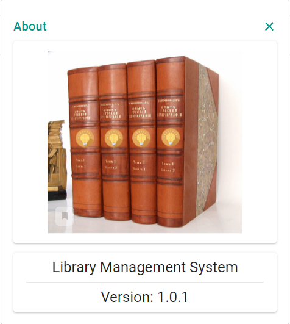
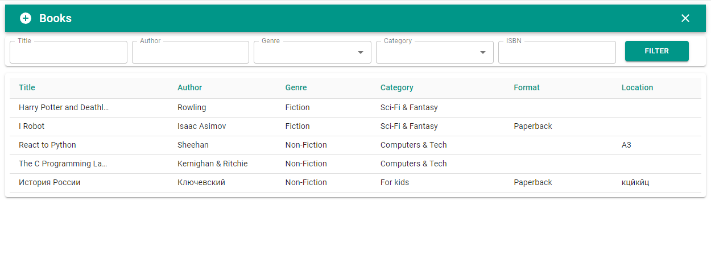
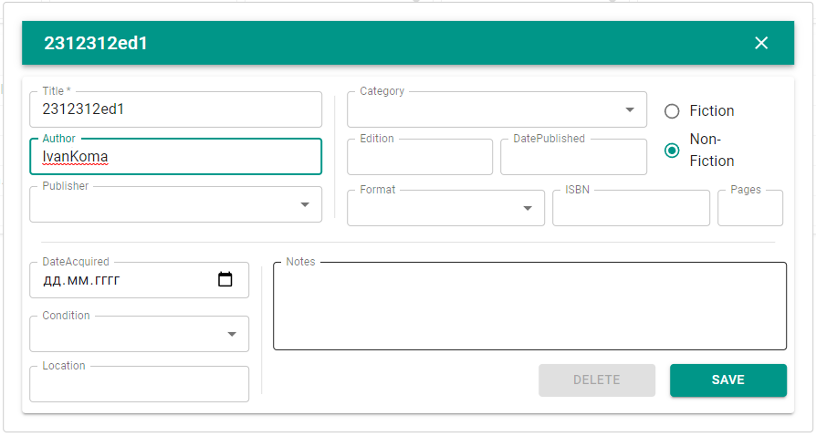

## React+Python Books App
### You can use this repository whenever you want
### Used for a video - https://www.youtube.com/watch?v=gKbYcBLkr7k

Create the database:
python -m dbutils

Start the web server:
python -m appserver

Activate the virtual environment: (ON THE CLIENT SIDE!)
venv\Scripts\activate (Windows)
source venv/bin/activate (Mac/Linux)

npm run dev on client folder!

login - admin
password - 123

<h3>JS Dependencies</h3>
<ul>
<li>"express"
<li>"http-proxy-middleware"
<li>"parcel-bundler"
<li>"parcel-plugin-bundle-visualiser"
<li>"parcel-plugin-transcrypt"
<li>"@babel/polyfill"
<li>"@material-ui/core"
<li>"@material-ui/icons"
<li>"deepcopy"
<li>"notistack"
<li>"react"
<li>"react-dom"
<li>"react-ga"
<li>"react-modal"
</ul>
